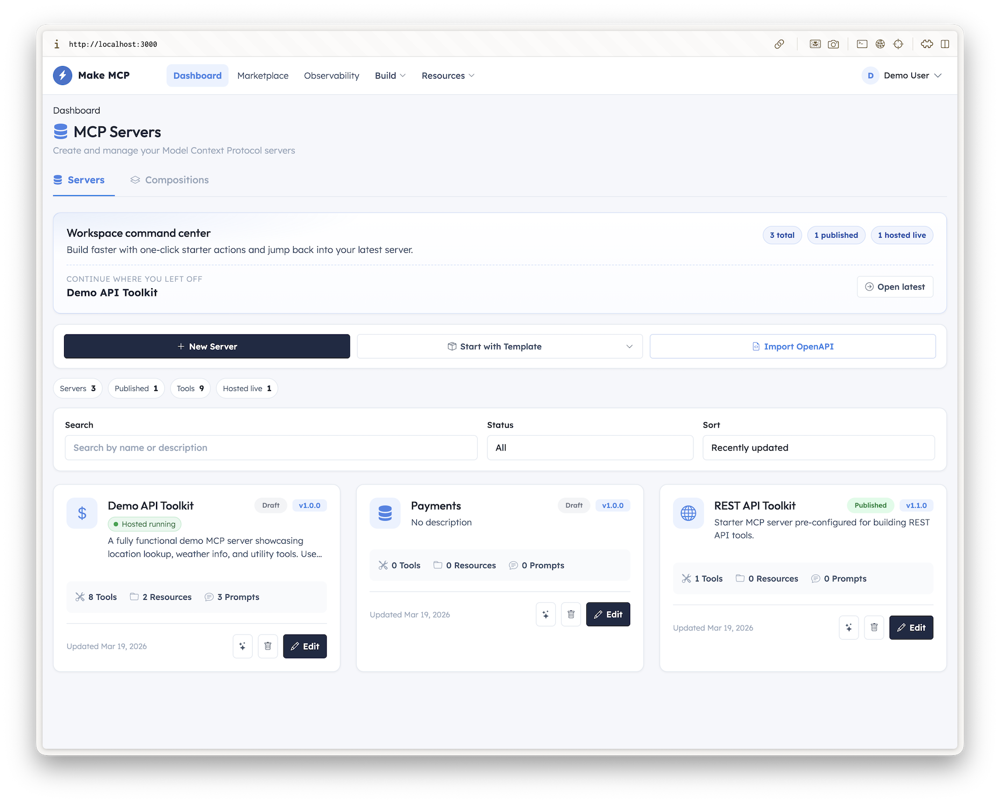
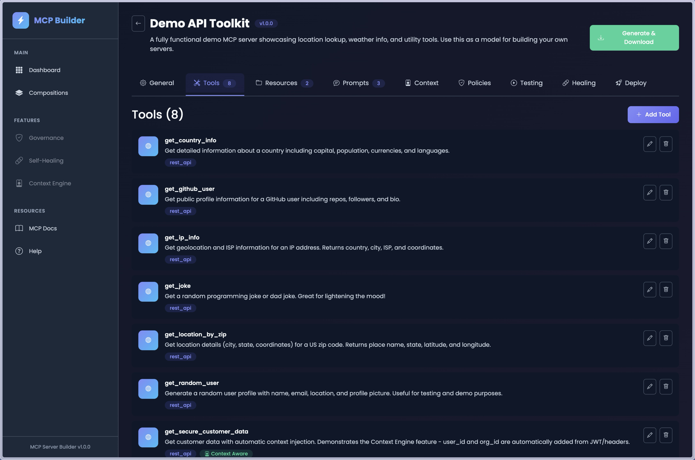
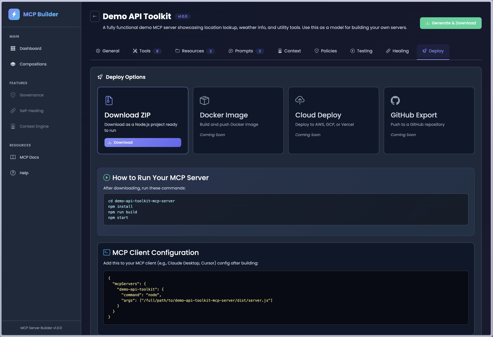
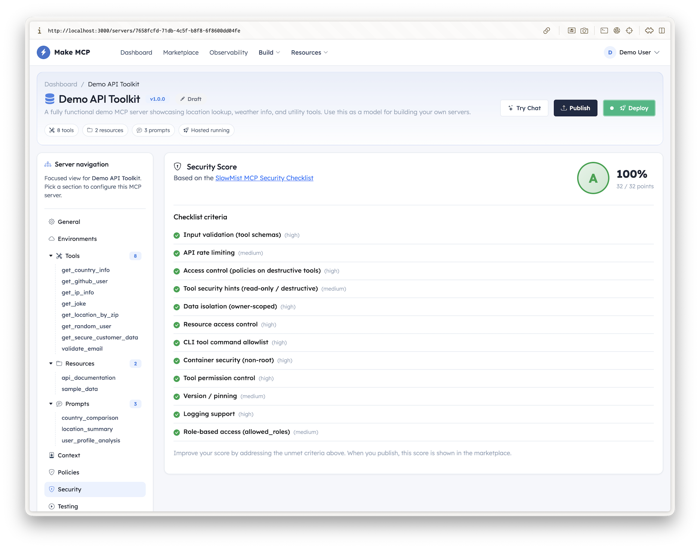
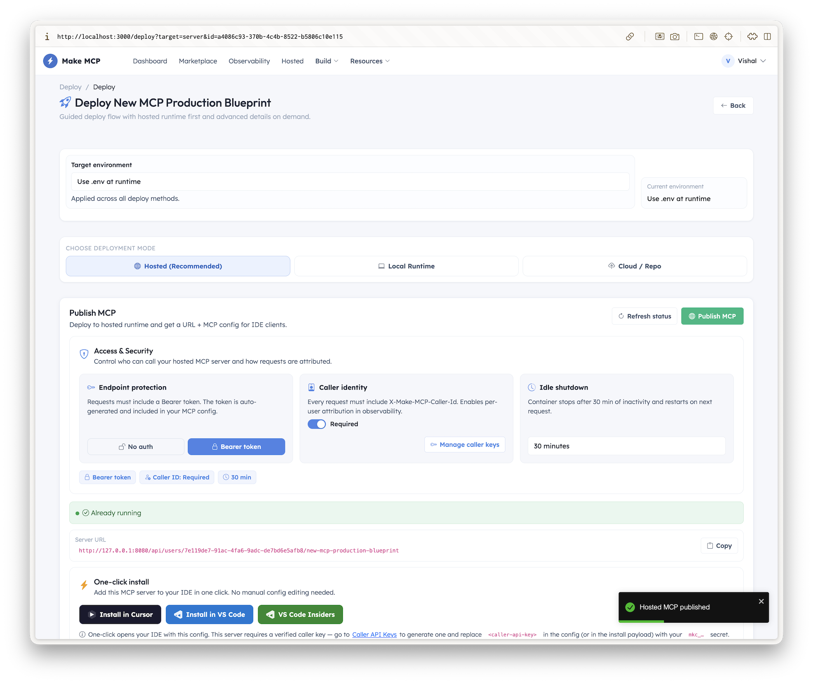

# Make MCP

<p align="center">
  
  
  
  
</p>

<p align="center">
  <strong>Build Model Context Protocol (MCP) servers visually — no code required.</strong>
</p>

<p align="center">
  Create plug-and-play MCP servers for AI agents, IDEs like Cursor, and platforms like Claude Desktop through an intuitive UI.
</p>


---

## Features

- **Visual Server Builder** — Create MCP servers through a drag-and-drop interface
- **Multiple Execution Types** — REST API, GraphQL, Webhooks, CLI (kubectl, docker, terraform), Database, JavaScript, Python, and Visual Flow (pipeline → tool)
- **Built-in Authentication** — API Key, Bearer Token, Basic Auth, OAuth 2.0 with visual configuration
- **Live Testing Playground** — Test tools before deployment
- **One-Click Export** — Download as Node.js project, ready to run
- **Context-Aware Execution** — Auto-inject user identity, permissions, org data
- **AI Governance Layer** — Policy engine to control tool access (rate limits, roles, approvals)
- **Self-Healing Tools** — Auto-detect failures and suggest fixes
- **Server Composition** — Combine multiple MCP servers into one
- **Security Score** — In-app score (0–100%, grade A–F) based on the [SlowMist MCP Security Checklist](https://github.com/slowmist/MCP-Security-Checklist); shown while building and in the marketplace

## Quick Start

### Prerequisites

- Go 1.22+
- Node.js 20+
- PostgreSQL 16+ (or Docker)

### Using Docker Compose (Recommended)

```bash
git clone https://github.com/vdparikh/make-mcp.git
cd make-mcp
docker-compose up --build
```

Open http://localhost:3000. **Sign up** with your email and name, then create a **passkey** (no password). Use the same passkey to sign in next time.

### Manual Setup

```bash
# 1. Start PostgreSQL
docker run -d --name mcp-builder-db \
  -e POSTGRES_USER=postgres \
  -e POSTGRES_PASSWORD=postgres \
  -e POSTGRES_DB=mcp_builder \
  -p 5432:5432 \
  postgres:16-alpine

# 2. Start Backend
cd backend
go mod download
go run ./cmd/server

# 3. Start Frontend (new terminal)
cd frontend
npm install
npm run dev
```

Open http://localhost:3000. **Register** with email and name, then add a **passkey** to sign in (passwordless).

## Authentication

Sign-in is **passkey-only** (WebAuthn). There are no passwords. Register with email and name, then create a passkey; use that passkey to sign in on this and supported devices.

## Creating Your First Server

After signing in, create a new server from the dashboard. You can add tools (REST, CLI, Flow, etc.), resources, and prompts, then generate and download the MCP server. Example tools you can add:

| Tool | Description |
|------|-------------|
| `get_location_by_zip` | US ZIP code lookup |
| `get_random_user` | Generate random user profiles |
| `get_ip_info` | IP geolocation |
| `get_joke` | Random dad jokes |
| `get_github_user` | GitHub profile lookup |
| `validate_email` | Email validation |
| `get_country_info` | Country details |
| `get_secure_customer_data` | Context injection demo |

## Screenshots

### Dashboard
Create and manage your MCP servers in one place.
 

### Tool Builder
Visual schema editor with execution types: REST, GraphQL, CLI, Flow, Database, and more.
 

### Testing Playground
Test tools with mock input before deployment.
 

### Security Score
 

### Download and Deploy
 

### Governance Policies
Define rules to control AI tool access.


## 3 Powerful Features

### 1. Context-Aware Tool Execution

Automatically inject user context into tool calls:

```json
{
  "name": "get_customer_data",
  "context_fields": ["user_id", "organization_id", "permissions"]
}
```

AI asks "Show me my invoices" → Tool automatically knows `customer_id = current_user`

### 2. AI Governance Layer

Define policies to control tool access:

```yaml
tool: send_payment
rules:
  - type: max_value
    field: amount
    max_value: 5000
  - type: allowed_roles
    roles: [finance_agent, admin]
  - type: time_window
    hours: 9-17
    weekdays: [Mon-Fri]
```

### 3. Self-Healing Tools

Auto-detect and fix common failures:

| Error | Auto-Suggestion |
|-------|-----------------|
| 401 Unauthorized | Refresh OAuth token |
| 429 Rate Limited | Retry with backoff |
| Schema mismatch | Update tool schema |

## Using Generated Servers

After downloading your MCP server:

```bash
cd my-server-mcp-server
npm install
npm run build
npm start
```

Add to your MCP client config:

```json
{
  "mcpServers": {
    "my-server": {
      "command": "node",
      "args": ["/path/to/my-server-mcp-server/dist/server.js"]
    }
  }
}
```

## Documentation

- [Getting Started Guide](./docs/getting-started.md) — Full setup and usage guide
- [Creating Servers](./docs/creating-servers.md) — Detailed guide to building MCP servers
- [Server Compositions](./docs/compositions.md) — Combining multiple servers into one
- [Security Best Practices](./docs/security-best-practices.md) — MCP security practices and the in-app security score

## Tech Stack

| Component | Technology |
|-----------|------------|
| Frontend | React, TypeScript, Vite, Bootstrap |
| Backend | Go, Gin, PostgreSQL |
| Code Editor | Monaco Editor |
| Generated Servers | Node.js, TypeScript, MCP SDK |


## License

MIT License - see [LICENSE](./LICENSE) for details.

